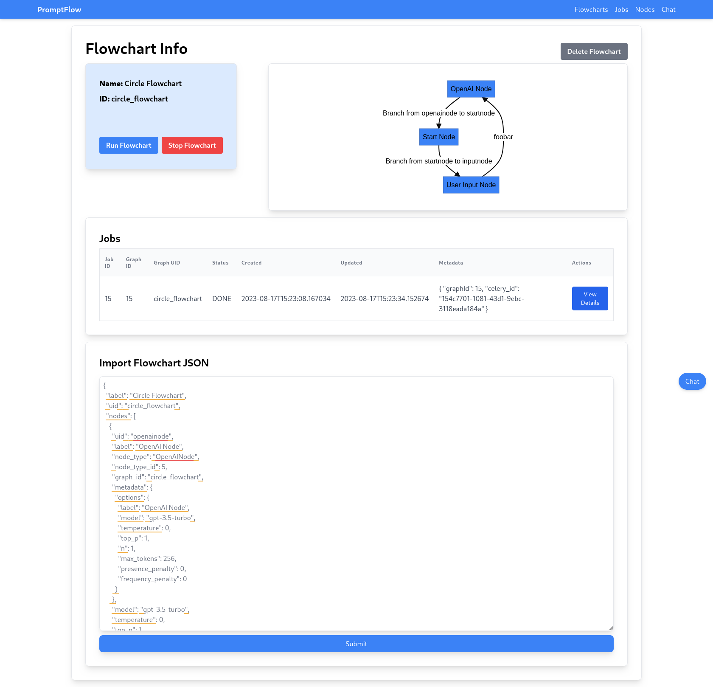

<p align="center">
  
</p>

---

# 🧩💡 PromptFlow

Want to quickly prototype your Large Language Model (LLM) application without a ton of code? Unleash your creativity with **PromptFlow**, a low-code tool that empowers you to craft executable flowcharts. Seamlessly integrate LLMs, prompts, Python functions, and conditional logic to create intricate workflows. With PromptFlow, you can visualize your ideas and bring them to life, all without getting tangled in code or complex logic.

<p align="center">
  
</p>

#### 🎮 Join the conversation on our [Discord Server](https://discord.gg/5MmV3FNCtN)

## 🔗 How it works

The core of PromptFlow is a visual flowchart editor that lets you design nodes and establish Connections between them. Each node can represent a Prompt, a Python function, or an LLM. The connections between nodes embody conditional logic, dictating the flow of your program.

When run your flowchart, PromptFlow executes each node in the sequence defined by the connections, transferring text data between nodes as required. If a node returns a value, that value is forwarded to the next node in the flow as a string. More information on the inner workings of PromptFlow can be found in our [documentation](https://www.promptflow.org/en/latest/).

## 🛠️ Initial Setup 

You can install PromptFlow via pip with

```bash
pip install promptflow-gui
```

If you want to install PromptFlow from source, clone this repository and install the dependencies with

```bash
python -m pip install -r requirements.txt
```

Encountered a hiccup? Try this instead:

```bash
python -m pip install -r requirements-no-nvidia.txt
```

## 🚀 Launching

If you installed from `pip`, you can launch PromptFlow with

```bash
promptflow
```

Otherwise, run PromptFlow with Python from the command line:

```bash
python run.py 
```

If you're hitting a roadblock, ensure your `PYTHONPATH` is set correctly:

```bash
export PYTHONPATH=$PYTHONPATH:.
```

## 📚 Documentation

[](https://www.promptflow.org/en/latest/?badge=latest)

Check out our official docs:

#### 🌐 [promptflow.org](https://www.promptflow.org/en/latest/)

### 🏗️ Building from source

To compile the Sphinx documentation, execute:

```bash
cd docs
make html
```

Then, navigate to `docs/build/html/index.html` in your browser.

## 🤝 Contributing

Want to contribute to PromptFlow? Get started by [building a node](https://www.promptflow.org/en/latest/development.html#starting-point-adding-a-node).

Stumbled upon a bug? Don't hesitate to create an issue, open a PR, or let us know on [Discord](https://discord.gg/5MmV3FNCtN).

## Feedback

We're interested in your feedback! If you've used PromptFlow, please fill out [this questionnaire](https://forms.gle/oaB71zRmZmD8Lc8M6).

