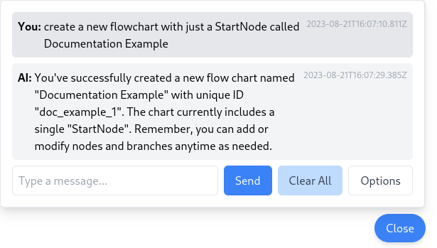

(Usage)=
# PromptFlow

PromptFlow is a Python application for creating and running conversational AI pipelines. It provides an interface for building pipelines and leverages FastAPI for the backend API.

(Running)=
# Running PromptFlow

Before starting, make sure to populate the `.env` file with the appropriate values. The `.env` file should be located in the root directory of the project.

## Docker Compose

The easiest way to run PromptFlow is with Docker Compose. To do so, run the following command:

```bash
docker compose up --build
```

This will run the DB, Redis, API (Backend), Celery Worker, and Frontend containers. The API will run on port `8069` by default, with the frontend
on port `4200`.

(Creation)=
# Creating a Flowchart

When you first visit the frontend, you'll be greeted with the home screen. From here, you can create view all flowcharts, or all [jobs](Jobs).


Click the `Flowcharts` button  to view all flowcharts. You can see all existing flowcharts, and scrolling down to the bottom, paste your own JSON to create a new flowchart.


As an example, paste in this code:

```json
{
  "label": "Documentation Example",
  "uid": "doc_example_1",
  "nodes": [
    {
      "uid": "start_node_1",
      "label": "Start",
      "node_type": "StartNode"
    }
  ],
  "branches": []
}
```

This will create a flowchart with a single node, the `StartNode`. This node is the entry point for all flowcharts, and is required for a flowchart to be valid.
Scroll up and click on the `Documentation Example` flowchart to view it.


While this flowchart doesn't do much, let's run it anyway. Click the `Run Flowchart` button in the top left corner. This should create a new Job under the `Jobs` tab. On the far-right of the new job, click the `View Details` button to view the job.


Let's try making this more interesting. In the flowchart view, go to the `Import Flowchart JSON` card, and edit the JSON as so:


```json
{
  "label": "Documentation Example",
  "uid": "doc_example_1",
  "nodes": [
    {
      "uid": "start_node_1",
      "label": "Start",
      "node_type": "StartNode"
    },
    {
        "uid": "random_node_1",
        "label": "Random",
        "node_type": "RandomNode"
    },
    {
        "uid": "random_node_2",
        "label": "Random2",
        "node_type": "RandomNode"
    }
  ],
  "branches": [
    {
        "uid": "branch_1",
        "prev": "start_node_1",
        "next": "random_node_1",
    },
    {
        "uid": "branch_2",
        "prev": "random_node_1",
        "next": "random_node_2",
    }
  ]
}
```

After saving, you should see the new nodes and branches in the flowchart view.


(Jobs)=
# Jobs

Jobs are the execution of a flowchart. They are created by running a flowchart. Jobs can be viewed from the home screen, or from the flowchart view.

Here's an example of a simple, completed Job:


## Job Input

If a job requires input at the current Node, the `Input` form will be displayed.


# Chat Interface

The chat interface is the primary way to create/edit a flowchart using natural language. The chat interface has access to the entire PromptFlow API, and can be used to create/edit flowcharts, run jobs, and more.



For a more advanced, and applicable flowchart, try the following Prompt:

```text
Create a flowchart named "Documentation Example 2" with a StartNode, an InputNode, and an OpenAINode, all linked together in a circle.
```

This will create a simple, memory-less chatbot. It can be run the same way as the previous flowchart. Input can be given to the Job as shown above, via the `Job Input` form.
